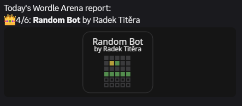

# Wordle Bot Arena



Make your fancy schmancy wordle guessing bot and battle it out in this Wordle (not associated in any way) Areana. >:)  

[Create your own solver bot](./docs/CREATE_BOT.md).

## Prerequisites

- Node ^24

## Setup

Add your `./webhooks.json` file like:
```json
[
  "https://discord.com/api/webhooks/..."
]
```
This is to send the results to discord.
If missing, app works just fine :).

Install node packages.
```bash
npm install
```

## Run

Start a single arena battle of today.

```bash
npm run start
```

Start battles every day at 8 AM.

```bash
npm run cron
```
